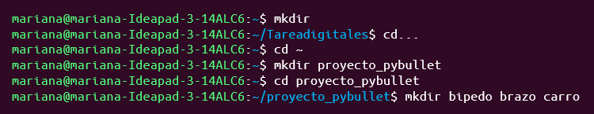
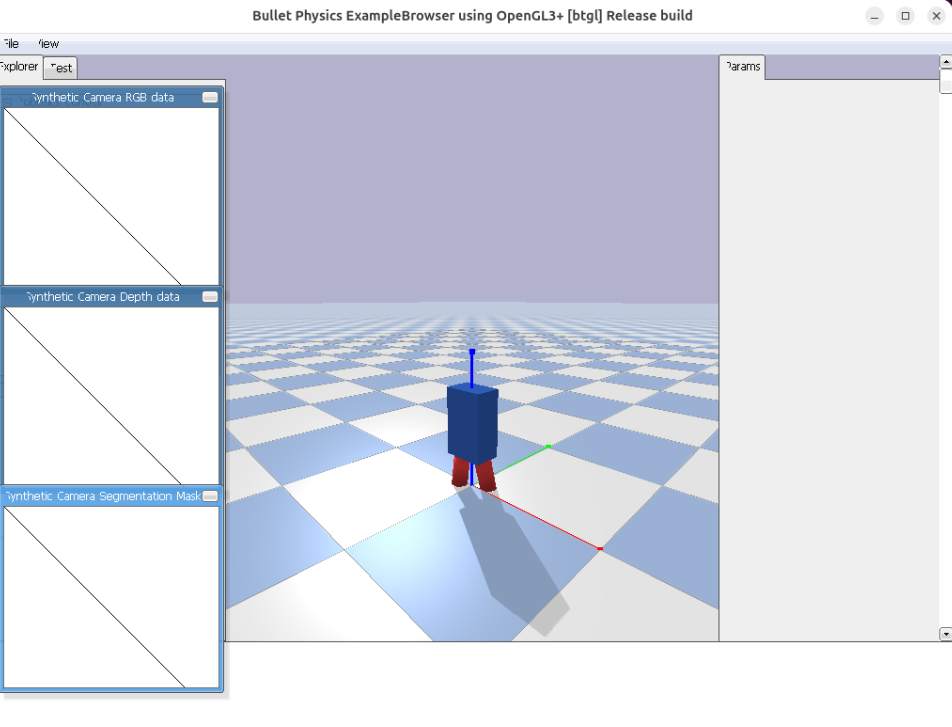
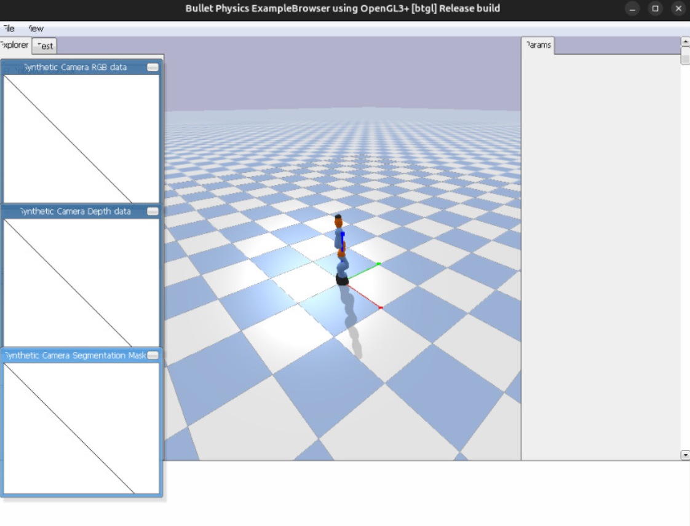
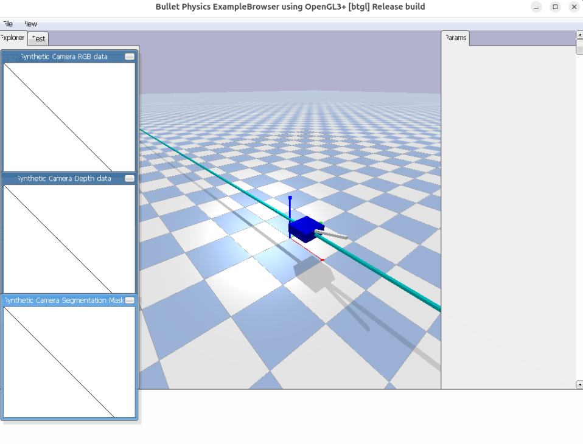

# Repositorio: Dockerización-PyBullet

Este repositorio agrupa tres simulaciones desarrolladas con **PyBullet** (Carro, Brazo y Bípedo), cada una ejecutable en su propio contenedor Docker. Incluye la estructura, el código base y los archivos necesarios para dockerizar y ejecutar las simulaciones.

## Creación de Archivos Python
Luego creamos los archivos de Python, en donde pegamos los códigos de cada uno de los ejemplos (Bípedo, Brazo y Carro).
(Coloca aquí las imágenes de cada script ejecutándose o el código abierto en VSCode)
 

## Creación del Dockerfile
Ahora, se crea un archivo Dockerfile para contener todos los archivos del proyecto.
(Coloca aquí la imagen mostrando el contenido del Dockerfile o el editor de texto)
 

## Construcción de Imágenes Docker
 

## Ejecución de los Contenedores
Una vez construidas las imágenes, iniciamos ejecutando cada uno de los ejemplos dentro de sus respectivos contenedores.
 
### Bípedo:
 

### Brazo Robótico:
 

### Carro:
 

