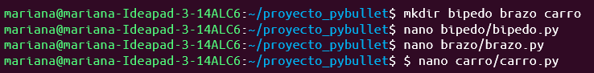
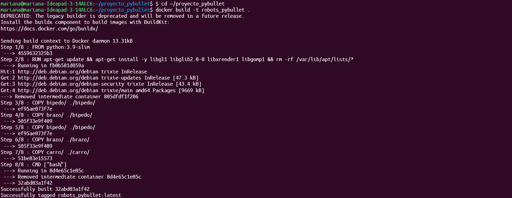

# Repositorio: Dockerización-PyBullet

Este repositorio agrupa tres simulaciones desarrolladas con **PyBullet** (Carro, Brazo y Bípedo), cada una ejecutable en su propio contenedor Docker. Incluye la estructura, el código base y los archivos necesarios para dockerizar y ejecutar las simulaciones.

## Creación de Archivos Python
Luego creamos los archivos de Python, en donde pegamos los códigos de cada uno de los ejemplos (Bípedo, Brazo y Carro).
(Coloca aquí las imágenes de cada script ejecutándose o el código abierto en VSCode)
 

## Archivo URDF del Bípedo
Se crea una carpeta especial para el Bípedo, con un archivo URDF, el cual ayuda a definir las propiedades físicas, visuales y cinemáticas del robot.
Esto permite que PyBullet interprete y modele al robot en un entorno 3D.
(Coloca aquí la imagen mostrando el modelo URDF del bípedo)
 

## Creación del Dockerfile
Ahora, se crea un archivo Dockerfile para contener todos los archivos del proyecto.
(Coloca aquí la imagen mostrando el contenido del Dockerfile o el editor de texto)
 

## Construcción de Imágenes Docker
Luego seguimos al paso de construir las imágenes Docker para cada simulación:
(Coloca aquí las imágenes mostrando el proceso de construcción en la terminal)
 

bash
Copiar código
docker build -t bipedo_pybullet:latest ./bipedo
docker build -t brazo_robotico:latest ./brazo_robotico
docker build -t carro_pybullet:latest ./carro
▶️ Ejecución de los Contenedores
Una vez construidas las imágenes, iniciamos ejecutando cada uno de los ejemplos dentro de sus respectivos contenedores.

### Bípedo:
 
image image

bash
Copiar código
docker run -it --rm bipedo_pybullet
### Brazo Robótico:
 
image

bash
Copiar código
docker run -it --rm brazo_robotico
### Carro:
 
image

bash
Copiar código
docker run -it --rm carro_pybullet
🧱 Explicación de Funcionamiento
Cada simulación corre dentro de un contenedor independiente, lo que permite mantener las dependencias y librerías controladas.
El archivo Dockerfile utiliza una imagen base de Python 3.10 e instala PyBullet automáticamente, asegurando compatibilidad con los tres ejemplos.

